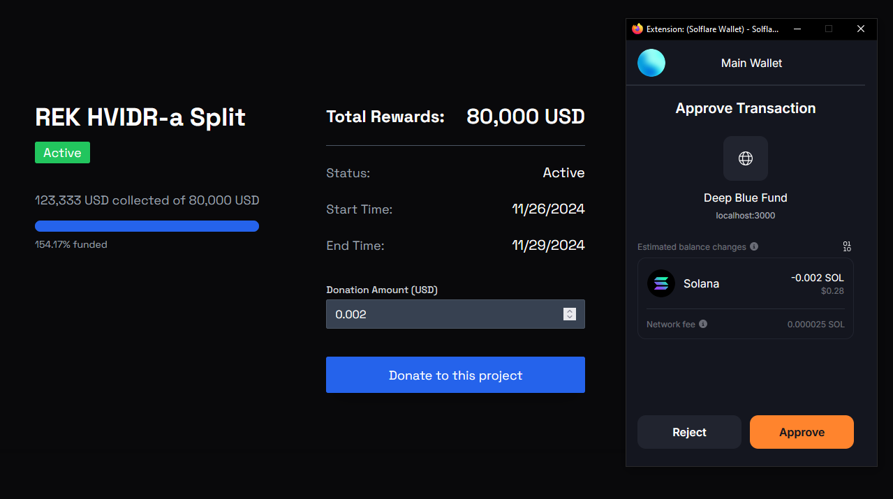

# deep-blue-fund

This project is generated with the [create-solana-dapp](https://github.com/solana-developers/create-solana-dapp) generator.

## Project Overview

**Deep Blue Fund** is a crowdfunding application built on the Solana blockchain, aimed at supporting local sea cleaning initiatives. It enables individuals and organizations to gather funds for environmental projects focused on preserving marine ecosystems.

By leveraging blockchain technology, the platform offers transparency in fund management and ensures that donors can trust where their contributions go. The project streamlines the process for fundraising, allowing users to create and back eco-friendly initiatives easily.

### Why Solana?

Solana was chosen for this project due to its:

- **Low Fees**: Transactions on Solana are extremely affordable, making it ideal for frequent and micro-transactions that are common in crowdfunding.
- **Speed**: Solana offers fast transaction processing, ensuring a smooth user experience and near-instantaneous confirmation of funds.
- **Developer-Friendly**: Solana’s development ecosystem is efficient, allowing for quicker deployment of decentralized applications, which makes it a perfect match for this project.

This combination allows Deep Blue Fund to be a scalable, effective, and low-cost solution for supporting environmental projects.

## Usage Instructions

To use the Deep Blue Fund application, follow these steps:

1. **Connect Your Solana Wallet**: Before you can interact with the projects, ensure that you connect your Solana wallet to the application. This is necessary for making donations and managing your contributions.

2. **Navigate to a Project**: Once your wallet is connected, you can browse the available projects focused on local sea cleaning initiatives.

3. **View Project Details**: Click on a project to view its details, including:

   - **Project Owner**: The individual or organization behind the project.
   - **Status**: Indicates if the project is Active, Upcoming, or Finished.
   - **Description**: A brief overview of the project’s goals and objectives.
   - **Total Rewards**: The funding goal for the project.
   - **Start and End Times**: When the project is scheduled to begin and end.

4. **Make a Donation**: If the project is Active or Upcoming, you will see a "Donate to this project" button, allowing you to contribute directly to the initiative in USD.

5. **Monitor Your Contributions**: Keep track of your donations and the projects you support through your wallet.

6. **Create Your own Sea Cleaning Initiative**: Apply your sea cleaning project to the project list by clicking the "Add new project" button (only admins are allowed to create projects, and currently all new collected wallets will be added as new admin users)



Feel free to explore the projects and make a difference in your community!

## Getting Started

### Prerequisites

- Node v18.18.0 or higher

- Rust v1.77.2 or higher
- Anchor CLI 0.30.1 or higher
- Solana CLI 1.18.17 or higher

### Installation

#### Clone the repo

```shell
git clone <repo-url>
cd <repo-name>
```

#### Install Dependencies

```shell
npm install
```

#### Start the web app

```
npm run dev
```

## Apps

### web

This is a React app that uses the Anchor generated client to interact with the Solana program.

#### Commands

Start the web app

```shell
npm run dev
```

Build the web app

```shell
npm run build
```
